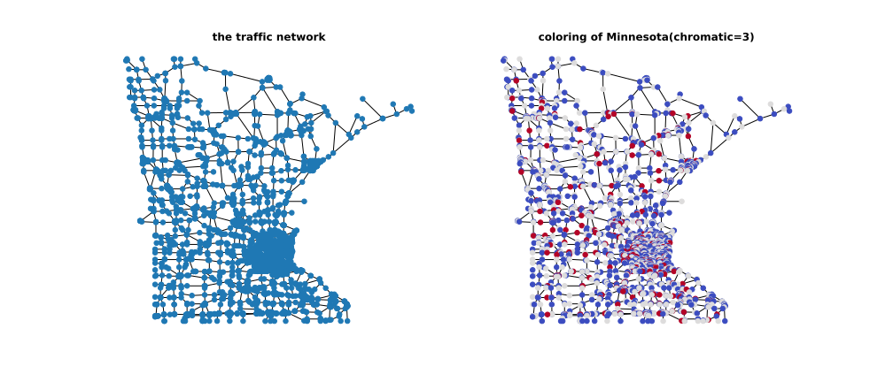
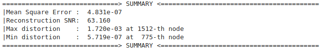
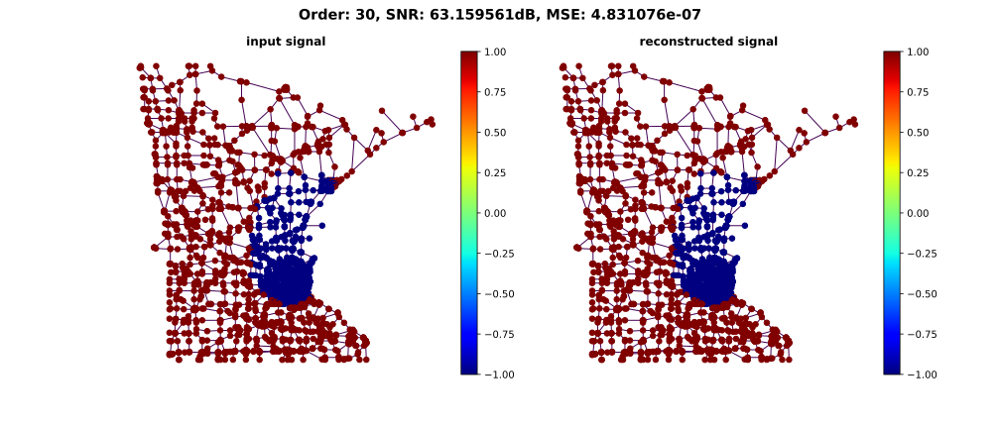

GraphQmf Wavelet Filterbank
===========================
We introduce the usage of graphQmf wavelet filterbank in **thgsp** here.

.. contents::
    :local:

.. note::
    For a thorough understanding of this note. You are supposed to have already understand GraphQmf
    and GraphBiorth wavelet filterbanks. However, if you care about how to use it, that's not necessary and
    remember that they are just filterbanks which define critically-sampling wavelet transform.
    Besides, code blocks in this note are all pieces of one whole.

Read and Plot Minnesota
-----------------------
The minnesota traffic network is a classic network pervasive in graph signal processing community. It has 2642
nodes and 3304 undirected edges, with a chromatic number of 3, meaning that it can be colored with 3 colors such
that no same color are assigned to adjacent nodes. You can easily access to the minnesota graph from **thgsp**.

.. code-block:: python

    from thgsp.datasets import Minnesota
    from thgsp.filters import ColorQmf
    from thgsp.alg import dsatur
    from thgsp.visual import draw_signal, draw_cn, draw
    import matplotlib.pyplot as plt
    data=Minnesota(connected=True)
    minne=data[0]
    print(minne)

GraphQmf [1]_  and GraphBiorth [2]_ filter bank require bipartite decomposition of the original graph into edge-disjoint
bipartite subgraphs on each of which one GraphQmf filterbank is constructed. All contructed GraphQmfs are then stacked
as a whole to perform multi-dimensional separable wavelet analysis.
The vanilla GraphQmf and GraphBiorth get the bipartite subgraphs in terms of the graph coloring result.
Though in those papers a :math:`O(n^3)` exact coloring is employed, many experiments show that inaccurate greedy
coloring is not likely to decrease the performance, i.e., the
reconstruction SNR. Therefore, we color the minnesota graph with the classic :obj:`dsatur` algorithm.

.. note::
    :class:`thgsp.filters.ColorQmf` and :class:`thgsp.filters.ColorBiorth` have already been integrated with
    :obj:`dsatur` algorithm, meaning that a graph coloring is invoked silently during the initialization of them.
    However, you can also initialize them with pre-computed coloring result to skip it. Here we firstly
    color the graph explicitly for a convenient visualization of coloring result.

.. code-block:: python

    # ==> continue the last code block
    colors = dsatur(minne)
    fig,axes= plt.subplots(1,2, figsize=(2 * 7, 6))
    draw(minne, minne.coords, ax=axes[0],node_size=30,with_labels=False)
    axes[0].set_title("the traffic network",fontsize='large', fontweight='bold')
    draw_cn(minne, minne.coords ,colors, ax=axes[1], node_size=30,with_labels=False)
    axes[1].set_title("coloring of Minnesota(chromatic={})".format(str(colors.max()+1)), fontsize='large', fontweight='bold')
    plt.show()

You can see the figure below.

Wavelet Transform via GraphQmf
------------------------------
This section we initialize a :  :class:`thgsp.filters.ColorQmf` and evaluate the wavelet transform determined by it
on a signal used in the original paper.

.. code-block:: python

    # ===> continue the last code block
    K=30              # the order of Chebyshev approximation
    qmf = ColorQmf(minne, order=K, vtx_color=colors)
    f = data.f                                     # (2642,) The signal
    wc= qmf.analyze(f)                             # analyze,            i.e., wavelet transform
    f4_hat= qmf.synthesize(wc)                     # synthesize,         i.e., inverse transform
    f_hat=f4_hat.sum(0).squeeze()                  # (4,2642,1)--> (2642,1) --> (2642)

.. note::
    Though GraphQmf wavelet filterbank determines a critically graph wavelet transform, :obj:`4x2642` floats is needed
    to store these coefficients other than :obj:`2642` floats. Such memory waste arises from the computation scheme
    adopted by the authors [1]_ and us.

Evaluation
----------
To evaluate the construction performance, SNR and MSE are taken into account. The next block will print them.

.. code-block:: python

    # ===> continue the last code block
    from thgsp.utils import snr, mse
    MSE = mse(f_hat, f).item()
    SNR = snr(f_hat, f).item()
    print("==============================> SUMMARY <=========================================")
    print(f"|Mean Square Error :  {MSE:.3e}")
    print(f"|Reconstruction SNR: {SNR: .3f}")

    dis = (f_hat - f).abs()
    print(f"|Max distortion    :  {dis.max().item():.3e} at {dis.argmax():4d}-th node")
    print(f"|Min distortion    :  {dis.min().item():.3e} at {dis.argmin():4d}-th node")
    print("==============================> SUMMARY <=========================================")

Let's draw the input and reconstructed signal and check the difference between them.

.. code-block:: python

    # ===> continue the last code block
    max_val = max(f.max(), f_hat.max())
    min_val = min(f.min(), f_hat.min())
    plt.figure(figsize=(2*7, 6))
    plt.suptitle("Order: {}, SNR: {:3f}dB, MSE: {:3e}".format(K, SNR, MSE), fontsize='x-large', fontweight='bold')

    ax1 = plt.subplot(121)
    plt.title("input signal", fontsize='large', fontweight='bold')
    draw_signal(minne, minne.coords, f, ax= ax1, cmap='jet', vmin=min_val, vmax=max_val,node_size=30, )

    ax2 = plt.subplot(122)
    plt.title("reconstructed signal", fontsize='large', fontweight='bold')
    draw_signal(minne, minne.coords, f_hat, ax2, 'jet', vmin=min_val, vmax=max_val, node_size=30)
    plt.show()

In addition to the default coloring-based bipartite approximation strategy [1]_, there are OSGLM [3]_, MFS [4]_, and
ADMM-BGA [5]_ strategies to transform the original arbitrary undirected graph into bipartite one(s). You can use them
by passing corresponding strategy :py:obj:`str` to :class:`thgsp.filters.ColorQmf` and :class:`thgsp.filters.NumQmf`.

.. [1] Sunil K. Narang, et al, Perfect Reconstruction Two-Channel Wavelet Filter Banks for Graph Structured Data, 2012.
.. [2] Sunil K. Narang, et al, Compact Support Biorthogonal Wavelet Filterbanks for Arbitrary Undirected Graphs, 2013.
.. [3] Akie Sakiyama, et al, Oversampled Graph Laplacian Matrix for Graph Filter Banks, 2014.
.. [4] Jin Zeng, et al, Bipartite subgraph decomposition for critically sampled wavelet filterbanks on arbitrary graphs, 2016.
.. [5] Aimin Jiang, et al, ADMM-BASED BIPARTITE GRAPH APPROXIMATION, 2019.