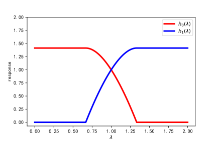

Introduction by Example
=======================
We introduce the fundamental components of thgsp here.

.. contents::
    :local:

Graph in thgsp
---------------

.. note::
    You are supposed to follow the code blocks step by step to avoid any program error.

A graph in `thgsp <https://github.com/bwdeng20/thgsp>`_ is
an instance of :obj:`thgsp.graphs.Graph` (for undirected graph) or
:obj:`thgsp.graphs.DiGraph` (for directed graph). You can initiate it from an adjacency matrix with any type
of :obj:`torch.Tensor`, :obj:`numpy.ndarray` and :obj:`scipy.spmatrix`.

.. code-block:: python

    import torch
    import numpy as np
    from thgsp.graphs import random_graph
    N=8 # number of nodes
    g=random_graph(N,density=0.4,weighted=False)
    g2=random_graph(N,density=0.3,directed=True)
    print(g)
    print(g2)

You can draw graphs with tools in :obj:`thgsp.visual`, which employs :obj:`networkx` to plot. Execute the following
block.

.. code-block:: python

    # ==> continue the last code block
    import matplotlib.pyplot as plt
    from thgsp.visual import draw,draw_cn, draw_signal
    fig,axes=plt.subplots(1,3,figsize=(9,3))
    draw(g,ax=axes[0])     # plain draw of graph
    draw_cn(g, pos=torch.rand(N,2),ax=axes[1]) # draw_cn will by default assign different colors to nodes.
    # `cmap` is the colormap of node colors,  `edge_cmap` is the colormap of edge colors.
    draw_signal(g2,signal=torch.rand(N),ax=axes[2], cmap = plt.get_cmap('jet'), edge_cmap= plt.get_cmap("copper"))
    plt.show()

You will get an image like this.

.. image:: ../_figures/thgsp-visual.svg
  :align: center

Graph Fourier Transform
-----------------------
To support brute-force graph filtering, :obj:`thgsp.graphs.Graph` can produce graph Fourier basis and graph frequencies
either in a *on-the-fly* or cache way. For large graphs, it can be unfriendly to cache them with respect to both memory
and computation since the graph Fourier basis is usually dense matrix. Note that :obj:`thgsp.graphs.DiGraph`'s
adjacency matrix are not symmetric and there is no acknowledged corresponding graph Fourier transform(GFT) defined.
Denote the adjacency and Laplacian(either normalized or not) matrices of an undirected graph
by :math:`A` and :math:`L` respectively, the Graph Fourier transform(GFT) originates from the eigenvalue
decomposition of either :math:`A` or :math:`L`. As both of two are symmetric, there must be an unitary matrix :math:`U`
such that :math:`A=U\Lambda U^T(or L=U\Lambda U^T)`.

.. code-block:: python

    # ==> continue the last code block
    L=g.L()         # SparseTensor
    basis=g.U()     # dense tensor
    frequency=g.spectrum()
    evd_err=(basis @ torch.diag(frequency) @ basis.t()- L.to_dense()).abs().sum() # check the EVD of normalized Laplacian
    print(evd_err)  # expected to be tiny

In the remainder contents, we adopt the graph Fourier transform defined with the normalized Laplacian
:math:`L=I-D^{-1/2}AD^{-1/2}`. Then GFT and the consequent spectral filtering can be formulated as:

.. math::
    \left\{\begin{array}{ll}
    G F T & \hat{s}_{\mathrm{in}}=U^{T} s_{\mathrm{in}} \\
    F i l t e r i n g & \hat{s}_{\mathrm{out}}=h(\Lambda) \hat{s}_{\mathrm{in}} \\
    I G F T & s_{\mathrm{out}}=U \hat{s}_{\mathrm{out}} \\
    \end{array}\right.

where :math:`s_{in}` and :math:`s_{out}` are the input and output graph signals, separately and :math:`\hat{s}_{in}`
is the graph Fourier coefficient of :math:`s_{in}`. After transforming :math:`s_{in}` into the spectral domain, a
polynomial function(kernel) :math:`h(\Lambda)` defined in the graph spectrum performs a element-wise
multiplication with :math:`\hat{s}_{in}` to attenuate or enhance spectral components of :math:`s_{in}`. For example,
if you'd like to filter out components with high frequency, i.e., high vibration, a low-pass kernel :math:`h(\Lambda)`,
e.g., :math:`h_0` displayed below, is desired.(Also you can see a high-pass kernel :math:`h_1`)

The bellowing code snippet shows graph Fourier transform on a random graph signal.

.. code-block:: python

    # ==> continue the last code block
    s_in=torch.rand(N)
    s_in_hat= basis.t() @ s_in  # GFT
    s_out_hat=s_in_hat          # Don't change any spectral components here
    s_out=basis @ s_out_hat     # IGFT
    err=(s_in-s_out).abs().sum()     # The signal is unaltered
    print(err)

Let's try to attenuate the high-frequency components. which can be done with an ideal low-pass filter. You can define an
ideal low-pass kernel or just import it from **thgsp**.

.. code-block:: python

    # ==> continue the last code block
    def my_ideal_kernel(frequencies):       # define the ideal low-pass kernel
        y=frequencies.new_ones(frequencies.shape)
        y[frequencies>1]=0
        y[frequencies==1]=0.5
        return y

    fs=g.spectrum()
    response=my_ideal_kernel(fs)    # the response of my_ideal_kernel
    s_out_hat= response * s_in_hat
    s_out=basis @ s_out_hat
    print("frequency:   ", frequency)
    print("s_out:       ",s_out)
    print("std of s_in: ",s_in.std())
    print("std of s_out:",s_out.std())

.. note::
    Note that all eigenvalues of symmetric normalized Laplacian are all scattered in :math:`[0,2]` and
    :math:`1` is the frequency that bisects the frequency domain.

After the low-pass filtering, we get a smoother graph signal :math:`s_{out}`, which has less vibration. You can plot
:math:`s_{out}` and  :math:`s_{in}` to check that.

.. code-block:: python

    # ==> continue the last code block
    import networkx as nx
    xy= nx.spring_layout(g.to_networkx(g.is_directed))
    plt.figure(figsize=(2 * 6, 2 * 6))
    # draw graph signals
    maximum=max(s_out.max(), s_in.max())
    minimum=max(s_out.min(), s_in.min())
    ax = plt.subplot(221)
    plt.title("The input signal")
    draw_signal(g, xy, s_in, ax, vmin=minimum,vmax=maximum)
    ax = plt.subplot(222)
    plt.title("The output signal")
    draw_signal(g, xy, s_out, ax, vmin=minimum,vmax=maximum)

    # plot kernel and response
    fre=torch.linspace(0,2,100)
    plt.subplot(223)
    plt.title("s_in_hat")
    plt.stem(fs.numpy(),s_in_hat.abs(),linefmt='grey',label="GFT coeffs of $s_{in}$")
    plt.plot(fre,my_ideal_kernel(fre),'--',label="ideal kernel",c='g')
    plt.xlabel("$\lambda$/ graph frequency")
    plt.legend()

    plt.subplot(224)
    plt.title("s_out_hat")
    plt.stem(fs.numpy(),s_out_hat.abs(),linefmt='grey',label="GFT coeffs of $s_{out}$")
    plt.plot(fre,my_ideal_kernel(fre),'--',label="ideal kernel",c='g')
    plt.xlabel("$\lambda$/ graph frequency")
    plt.legend()
    plt.show()

You could see a figure similar to the following one.

.. image:: ../_figures/GFTdemo.svg
  :align: center

Graph Filter(bank) in thgsp
----------------------------
The plain GFT filter(bank) is implemented as :class:`thgsp.filters.Filter`, which keeps :obj:`Co*Ci` frequency
response kernels (functions) to filter :obj:`Ci` input channel signals and combine the results to get :obj:`Co` output
channel signals, with predefined channel aggregation weights. :class:`thgsp.filters.Filter` can cope with
the input signals carried by either :obj:`(N,Ci)` or :obj:`(N,)` :py:class:`Tensor`. We now introduce it with a plainest
case wherein the processing of a :obj:`(N,)` tensor by :class:`thgsp.filters.Filter` with only 1 input and output channel
is considered.

.. code-block:: python

    # ==> continue the last code block
    from thgsp.filters import Filter
    filter1= Filter(g,my_ideal_kernel,order=50)
    print(filter1)                          # check the information of filter1
    y1= filter1(s_in,cheby=False)           # Filtering s_in
    y2= filter1(s_in)                       # Filtering s_in with 100-deg Chebyshev approximation
    print("y1   :", y1)
    print("y2   :", y2)
    print("s_out:", s_out)
    assert (s_out-y1).abs().sum() < 1e-6    # check the result by comparing y1 with s_out

As shown by :obj:`y2`, the error of Chebyshev approximation is not trivial. This err can be decreased via replacing
ideal low-pass kernel by other ones having smoother transition at λ = 1.

Such graph filter has already been implemented in `pygsp <https://pygsp.readthedocs.io/en/stable/>`_. Let's try
something new. Suppose our signals are with 3 input channels, and we tend to transform them into signals(or features)
with 2 output channels. To construct such MIMO style graph filter banks, :obj:`Co x Ci` (here :obj:`2 x 3=6`) kernels
are in need. The signal of each output channel is determined by those of all input channels. You may be
curious about how :obj:`6` filtered signals are transformed to :obj:`2` signals. The mechanism is as simple as
a weighted summation of :obj:`3` filtered signals. And the weights can be determined by users when they
initialize an instance of :class:`thgsp.filters.Filter` or just leave them identical to 1 by default.
In **thgsp**, such MIMO filterbanks require a :py:class:`np.ndarray` of kernels shaped as :obj:`Co x Ci`.
Let's create a filter-bank consisting of ideal low-pass  and ideal high-pass kernels.

.. code-block:: python

    # ==> continue the last code block
    def ideal_hp_kernel(x):         # define an ideal high-pass kernel
        y=x.new_ones(x.shape[-1])
        y[x<1]=0
        y[x==1]=0.5
        return y
    krns = np.array([[my_ideal_kernel,    my_ideal_kernel,    my_ideal_kernel],
                     [ideal_hp_kernel, ideal_hp_kernel,   ideal_hp_kernel]])  # 2(Cout) x 3(Cin) kernel array
    mimo_filter=Filter(g,krns,order=50)
    print(mimo_filter)
    out1=mimo_filter(s_in,False)
    out2=mimo_filter(s_in)
    print(out1.shape)       # (8, 2)
    print(out2.shape)       # (8, 2)

The signal of first output channel is a weighted summation of three filtered input signals.
Since all-one weights are used by default,  :obj:`s_out` ought to be 3 times over :obj:`y` in the
first output channel.  Check it!

.. code-block:: python

    # ==> continue the last code block
    assert torch.allclose(out1[:,0]/3, y1)
    assert torch.allclose(out2[:,0]/3, y2)

The full eigenvalue decomposition of large sparse matrix is insufferably slow. Hence David K Hammond,
et. al., [1]_ propose to bypass EVD with Chebyshev approximation. But the approximation error for some kernels is
not negligible in the context of GFT-based filters. Beyond GFT is graph wavelet analysis.
David K Hammond, et al., have built  one framework of graph wavelet analysis, and the details can be found in the
referenced paper. We don't provide out-of-the-box tools for this analysis framework because there is an official
package -- `pygsp <https://pygsp.readthedocs.io/en/stable/>`_ that supports it. Even so, you can implement them on the basis of
:class:`thgsp.filters.Filter`.

In the next note, we introduce a two-channel wavelet filterbank [2]_ for bipartite graph and extendable for arbitrary
undirected graph. This wavelet filterbank determines one kind of graph wavelet transform distinguishing itself from the
aforementioned one by the critical sampling, which means that the number of wavelet coefficients is equal to that of
graph nodes.

.. [1] David K Hammond, et al., Wavelets on Graphs via Spectral Graph Theory, 2011
.. [2] Sunil K. Narang, et al, Perfect Reconstruction Two-Channel Wavelet Filter Banks for Graph Structured Data, 2012